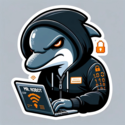

# Flipper Zero Scripts & Files


Bienvenido a este repositorio, una colección completa de scripts y archivos diseñados para sacar el máximo provecho de tu Flipper Zero. Aquí encontrarás recursos organizados en categorías como SubGHz, Jamming SubGHz, Infrarrojos (IR), Animaciones, Scripts BadUSB y Páginas HTML para Evil Portal, ideales para entusiastas, hackers éticos y usuarios curiosos.

## Tabla de Contenidos 📌 
- [Descripción](#descripción-)
- [Contenidos](#contenidos-)
  1. [Frecuencias SubGHz](#1-frecuencias-subghz)
  2. [Jamming SubGHz](#2-jamming-subghz-%EF%B8%8F)
  3. [Archivos Infrarrojos (IR)](#3-archivos-infrarrojos-ir)
  4. [Animaciones](#4-animaciones-)
  5. [Páginas HTML para Evil Portal](#5-páginas-html-para-evil-portal-%EF%B8%8F%EF%B8%8F)
  6. [Scripts BadUSB](#6-scripts-badusb-%EF%B8%8F)
- [Requisitos](#-requisitos)
- [Instrucciones de Instalación](#-instrucciones-de-instalación)
- [Uso Responsable](#%EF%B8%8F-uso-responsable)
- [Contribuciones](#-contribuciones)
- [Licencia](#-licencia)
- [Agradecimientos](#-agradecimientos)

## Descripción 📖 


El Flipper Zero es un dispositivo versátil para experimentación en seguridad, análisis de señales y automatización. Este repositorio reúne herramientas y archivos útiles para explorar sus capacidades, desde capturar señales SubGHz hasta personalizar la interfaz con animaciones o simular dispositivos USB. Todos los recursos han sido probados y organizados para facilitar su uso.

## Contenidos 📂

### 1. Frecuencias SubGHz
Archivos y scripts para interactuar con dispositivos que operan en el espectro SubGHz (como controles remotos, sensores IoT y más).

**Archivos incluidos:**
- Frecuencias preconfiguradas para dispositivos comunes.
- Capturas de señales listas para reproducir.

**Uso:**
- Explora señales con la aplicación SubGHz del Flipper Zero.
- Tutorial básico incluido en `SubGHz/README.md`.

### 2. Jamming SubGHz ⚠️
Scripts diseñados para interferir señales SubGHz. ⚠️ **Advertencia:** El uso de jamming puede ser ilegal en muchos países; infórmate sobre las leyes locales antes de utilizar esta funcionalidad.

**Archivos incluidos:**
- Scripts para bloquear frecuencias específicas.
- Ejemplos comentados para personalización.

**Notas legales:**
- Uso exclusivo para entornos controlados y autorizados (ej. pruebas de seguridad).

### 3. Archivos Infrarrojos (IR)
Colección de señales Infrarrojas (IR) para controlar dispositivos como televisores, aires acondicionados, proyectores y más.

**Archivos incluidos:**
- Biblioteca de comandos IR para marcas populares (Samsung, LG, etc.).
- Plantillas para capturar nuevas señales.

**Instrucciones:**
- Carga los archivos en la carpeta `infrared/` del Flipper Zero.
- Guía paso a paso en `IR/README.md`.

### 4. Animaciones 🎨
Personaliza la pantalla de tu Flipper Zero con animaciones únicas y creativas.

**Archivos incluidos:**
- Animaciones en formato compatible (`.bm`).
- Temas variados: retro, minimalistas, divertidos.

**Instalación:**
- Copia los archivos a la carpeta `dolphin/` del dispositivo.
- Tutorial detallado en `Animations/README.md`.

### 5. Páginas HTML para Evil Portal 🕵️‍♂️
Páginas web falsas diseñadas para el módulo Evil Portal del Flipper Zero, útiles para pruebas de phishing o demostraciones educativas.

**Archivos incluidos:**
- Plantillas de portales de servicios conocidos (Wi-Fi, bancos, etc.).
- Diseños responsivos y ligeros.

**Uso:**
- Configura el Evil Portal en tu Flipper Zero y carga estas páginas en la SD.

### 6. Scripts BadUSB 🖥️
Scripts que convierten tu Flipper Zero en un dispositivo BadUSB, simulando un teclado para ejecutar comandos en computadoras.

**Archivos incluidos:**
- Automatización de tareas (Windows, Linux, macOS).
- Payloads de pentesting (ej. abrir terminales, descargar herramientas).

**Ejemplos:**
- `rickroll.txt`: Reproduce un Rickroll en el navegador.
- `sysinfo.txt`: Extrae información del sistema.

⚠️ **Advertencia:** Usa solo en entornos autorizados.

---

## 🔧 Requisitos
- Flipper Zero con firmware actualizado (mínimo v1.0.0).
- Tarjeta microSD formateada en FAT32.
- Cable USB para transferencia de archivos.
- Software como qFlipper o acceso manual a la SD.

## 🚀 Instrucciones de Instalación

### 1️⃣ Clonar el repositorio
```bash
git clone https://github.com/dolaraso/flipper-cyber.git
```

### 2️⃣ Preparar el Flipper Zero
- Conecta el dispositivo a tu computadora vía USB.
- Inserta la tarjeta microSD si no está instalada.

### 3️⃣ Transferir archivos
Copia los archivos a las carpetas correspondientes en la SD:
- `subghz/` para frecuencias y jamming.
- `infrared/` para archivos IR.
- `dolphin/` para animaciones.
- `badusb/` para scripts BadUSB.
- `evil_portal/` (o similar) para páginas HTML.

### 4️⃣ Probar
- Desconecta el Flipper Zero y navega a las aplicaciones correspondientes para usar los archivos.

---

## ⚠️ Uso Responsable
- **SubGHz y Jamming:** Verifica las leyes locales sobre el uso de frecuencias e interferencias.
- **BadUSB:** Solo para pruebas de seguridad autorizadas.
- **Evil Portal:** No utilizar con fines de phishing no autorizado.

---

## 🤝 Contribuciones
¡Tu aporte es bienvenido! Para contribuir:
1. **Haz un fork** del repositorio.
2. **Crea una rama** con tus cambios:  
   ```bash
   git checkout -b mi-contribucion
   ```
3. **Sube tus archivos o edita los existentes**.
4. **Envía un pull request** con una descripción clara.
5. ¿Ideas o problemas? **Abre un issue**.

---

## 📜 Licencia
Este proyecto está bajo la **Licencia MIT**. Puedes usar, modificar y distribuir los archivos libremente, siempre que respetes los términos.

---

## 🙌 Agradecimientos
- A la comunidad de **Flipper Zero** por compartir conocimiento.
- A los desarrolladores de herramientas como **qFlipper** y firmware personalizado.

